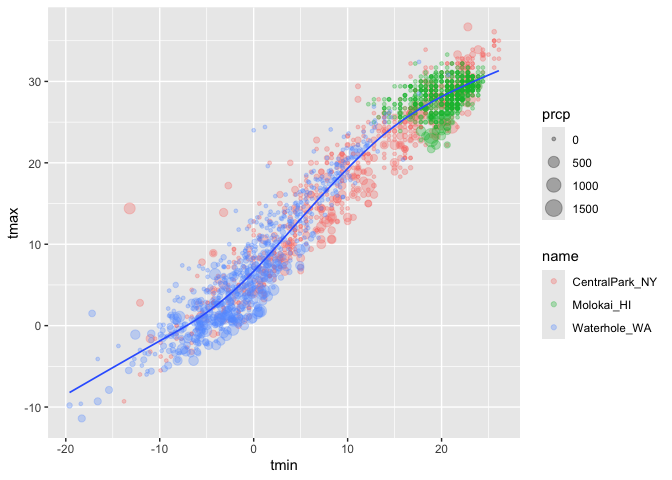
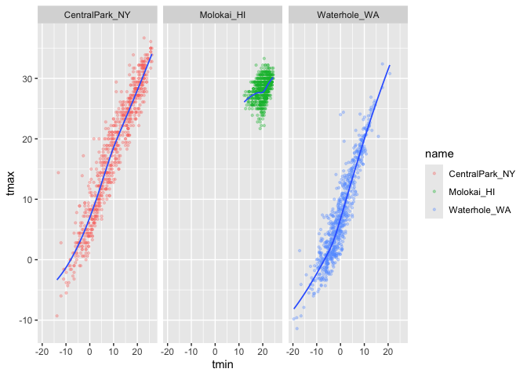
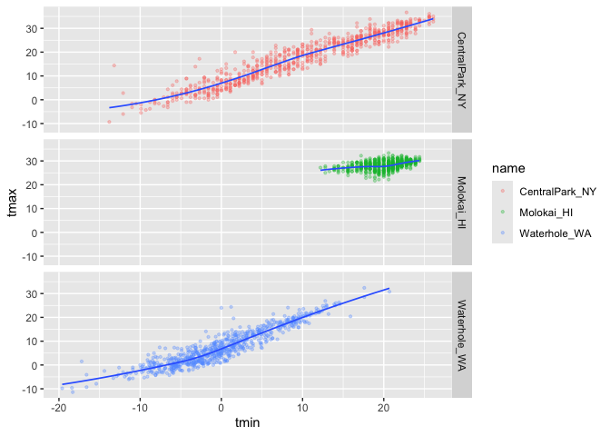
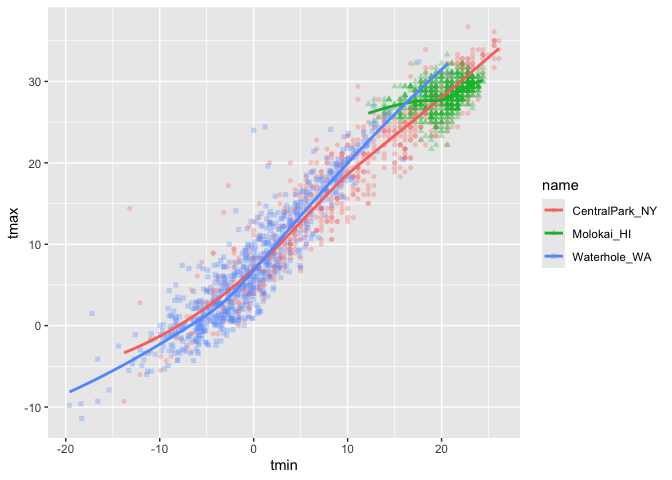
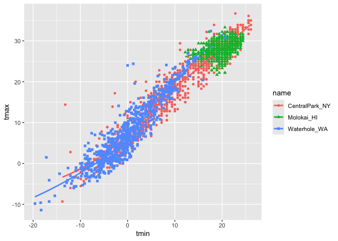
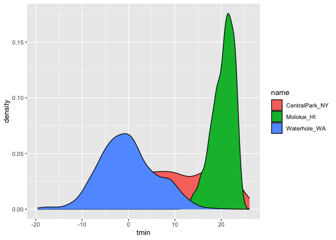
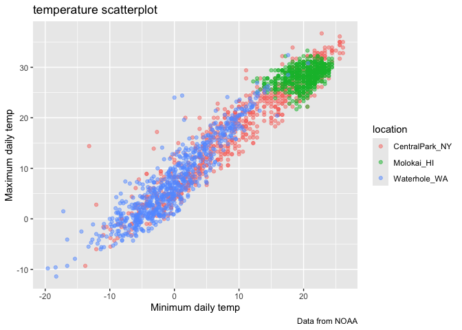
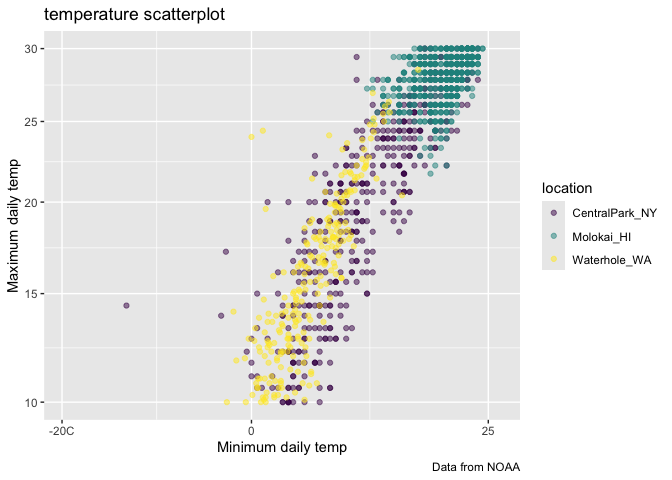
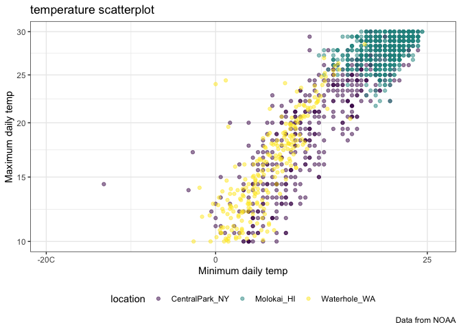

visualization
================
Nelson Gaillard
2025-09-25

## Visualization 1

Import the weather data

``` r
data("weather_df")
```

Making our first plot :-)

``` r
ggplot(weather_df, mapping = aes(x = tmin, y = tmax)) +
  geom_point()
```

    ## Warning: Removed 17 rows containing missing values or values outside the scale range
    ## (`geom_point()`).

<!-- -->

``` r
weather_df |>
  ggplot(aes(x = tmin, y = tmax))+
  geom_point()
```

    ## Warning: Removed 17 rows containing missing values or values outside the scale range
    ## (`geom_point()`).

<!-- -->

``` r
ggp_weather_scatterplot = 
  weather_df |>
    ggplot(aes(x = tmin, y = tmax))+
    geom_point()

ggp_weather_scatterplot
```

    ## Warning: Removed 17 rows containing missing values or values outside the scale range
    ## (`geom_point()`).

<!-- -->

``` r
weather_df |>
  filter(is.na(tmax))
```

    ## # A tibble: 17 × 6
    ##    name         id          date        prcp  tmax  tmin
    ##    <chr>        <chr>       <date>     <dbl> <dbl> <dbl>
    ##  1 Molokai_HI   USW00022534 2022-05-31    NA    NA    NA
    ##  2 Waterhole_WA USS0023B17S 2021-03-09    NA    NA    NA
    ##  3 Waterhole_WA USS0023B17S 2021-12-07    51    NA    NA
    ##  4 Waterhole_WA USS0023B17S 2021-12-31     0    NA    NA
    ##  5 Waterhole_WA USS0023B17S 2022-02-03     0    NA    NA
    ##  6 Waterhole_WA USS0023B17S 2022-08-09    NA    NA    NA
    ##  7 Waterhole_WA USS0023B17S 2022-08-10    NA    NA    NA
    ##  8 Waterhole_WA USS0023B17S 2022-08-11    NA    NA    NA
    ##  9 Waterhole_WA USS0023B17S 2022-08-12    NA    NA    NA
    ## 10 Waterhole_WA USS0023B17S 2022-08-13    NA    NA    NA
    ## 11 Waterhole_WA USS0023B17S 2022-08-14    NA    NA    NA
    ## 12 Waterhole_WA USS0023B17S 2022-08-15    NA    NA    NA
    ## 13 Waterhole_WA USS0023B17S 2022-08-16    NA    NA    NA
    ## 14 Waterhole_WA USS0023B17S 2022-08-17    NA    NA    NA
    ## 15 Waterhole_WA USS0023B17S 2022-08-18    NA    NA    NA
    ## 16 Waterhole_WA USS0023B17S 2022-08-19    NA    NA    NA
    ## 17 Waterhole_WA USS0023B17S 2022-12-31    76    NA    NA

## Fancier scatterplots!

``` r
weather_df |>
  ggplot(aes(x = tmin, y = tmax, color = name)) +
  geom_point(alpha = 0.3) +
  geom_smooth(se = FALSE)
```

    ## `geom_smooth()` using method = 'loess' and formula = 'y ~ x'

    ## Warning: Removed 17 rows containing non-finite outside the scale range
    ## (`stat_smooth()`).

    ## Warning: Removed 17 rows containing missing values or values outside the scale range
    ## (`geom_point()`).

<!-- -->

Where you define aestherics can matter

``` r
weather_df |>
  ggplot(aes(x = tmin, y = tmax)) +
  geom_point(aes(color = name, size = prcp), alpha = 0.3) +
  geom_smooth(se = FALSE, size = 0.6)
```

    ## Warning: Using `size` aesthetic for lines was deprecated in ggplot2 3.4.0.
    ## ℹ Please use `linewidth` instead.
    ## This warning is displayed once every 8 hours.
    ## Call `lifecycle::last_lifecycle_warnings()` to see where this warning was
    ## generated.

    ## `geom_smooth()` using method = 'gam' and formula = 'y ~ s(x, bs = "cs")'

    ## Warning: Removed 17 rows containing non-finite outside the scale range
    ## (`stat_smooth()`).

    ## Warning: Removed 19 rows containing missing values or values outside the scale range
    ## (`geom_point()`).

<!-- -->

use faceting real quick

``` r
weather_df |>
  ggplot(aes(x = tmin, y = tmax)) +
  geom_point(aes(color = name), alpha = 0.3, size = 0.8) +
  geom_smooth(se = FALSE, size = 0.6) +
  facet_grid(. ~ name)
```

    ## `geom_smooth()` using method = 'loess' and formula = 'y ~ x'

    ## Warning: Removed 17 rows containing non-finite outside the scale range
    ## (`stat_smooth()`).

    ## Warning: Removed 17 rows containing missing values or values outside the scale range
    ## (`geom_point()`).

<!-- -->

``` r
weather_df |>
  ggplot(aes(x = tmin, y = tmax)) +
  geom_point(aes(color = name), alpha = 0.3, size = 0.8) +
  geom_smooth(se = FALSE, size = 0.6) +
  facet_grid(name ~ .)
```

    ## `geom_smooth()` using method = 'loess' and formula = 'y ~ x'

    ## Warning: Removed 17 rows containing non-finite outside the scale range
    ## (`stat_smooth()`).
    ## Removed 17 rows containing missing values or values outside the scale range
    ## (`geom_point()`).

<!-- -->

Let’s make a somewhat more interesting scatterplot

``` r
weather_df |>
  ggplot(aes(x = tmin, y = tmax, color = name, shape = name)) +
  geom_point(aes(size = prcp), alpha = 0.3) +
  geom_smooth(se = FALSE, size = 0.6) +
  facet_grid(. ~ name)
```

    ## `geom_smooth()` using method = 'loess' and formula = 'y ~ x'

    ## Warning: Removed 17 rows containing non-finite outside the scale range
    ## (`stat_smooth()`).

    ## Warning: Removed 19 rows containing missing values or values outside the scale range
    ## (`geom_point()`).

<!-- -->

Learning Assessment: Write a code chain that starts with weather_df;
focuses only on Central Park, converts temperatures to Fahrenheit, makes
a scatterplot of min vs. max temperatures, and overlays a linear
regression line (using options in geom_smooth())

``` r
weather_df |>
  filter(name == "CentralPark_NY") |>
  mutate(
    tmax_fahr = tmax * (9/5) + 32,
    tmin_fahr = tmin * (9/5) + 32
  ) |>
  ggplot(aes(x = tmin_fahr, y = tmax_fahr)) +
    geom_point() +
    geom_smooth(se = FALSE, method = "lm")
```

    ## `geom_smooth()` using formula = 'y ~ x'

<!-- -->

## Small things

``` r
weather_df |>
  ggplot(aes(x = tmin, y = tmax, color = name, shape = name)) +
  geom_point(alpha = 0.3) +
  geom_smooth(se = FALSE)
```

    ## `geom_smooth()` using method = 'loess' and formula = 'y ~ x'

    ## Warning: Removed 17 rows containing non-finite outside the scale range
    ## (`stat_smooth()`).

    ## Warning: Removed 17 rows containing missing values or values outside the scale range
    ## (`geom_point()`).

<!-- -->

``` r
weather_df |>
  ggplot(aes(x = tmin, y = tmax, color = name, shape = name)) +
  geom_smooth(se = FALSE) +
  geom_point()
```

    ## `geom_smooth()` using method = 'loess' and formula = 'y ~ x'

    ## Warning: Removed 17 rows containing non-finite outside the scale range
    ## (`stat_smooth()`).
    ## Removed 17 rows containing missing values or values outside the scale range
    ## (`geom_point()`).

<!-- -->

``` r
weather_df |>
  ggplot(aes(x = tmin, y = tmax)) +
  geom_hex()
```

    ## Warning: Removed 17 rows containing non-finite outside the scale range
    ## (`stat_binhex()`).

<!-- -->

``` r
weather_df |>
  ggplot(aes(x = tmin, y = tmax)) +
  geom_point(color = "purple")
```

    ## Warning: Removed 17 rows containing missing values or values outside the scale range
    ## (`geom_point()`).

<!-- -->

## Univariate plots

``` r
weather_df |>
  ggplot(aes(x = tmin)) +
  geom_histogram(color = "white", fill = "red")
```

    ## `stat_bin()` using `bins = 30`. Pick better value with `binwidth`.

    ## Warning: Removed 17 rows containing non-finite outside the scale range
    ## (`stat_bin()`).

<!-- -->

``` r
weather_df |>
  ggplot(aes(x = tmin, fill = name)) +
  geom_histogram() +
  facet_grid(name ~ .)
```

    ## `stat_bin()` using `bins = 30`. Pick better value with `binwidth`.

    ## Warning: Removed 17 rows containing non-finite outside the scale range
    ## (`stat_bin()`).

<!-- -->

Maybe a density plot?

``` r
weather_df |>
  ggplot(aes(x = tmin, fill = name)) +
  geom_density(lpha = 0.2)
```

    ## Warning in geom_density(lpha = 0.2): Ignoring unknown parameters: `lpha`

    ## Warning: Removed 17 rows containing non-finite outside the scale range
    ## (`stat_density()`).

<!-- -->

``` r
weather_df |>
  ggplot(aes(x = name, y = tmin)) +
  geom_boxplot(aes(fill = name))
```

    ## Warning: Removed 17 rows containing non-finite outside the scale range
    ## (`stat_boxplot()`).

<!-- -->

violin plots

``` r
weather_df |>
  ggplot(aes(x = name, y = tmin, fill = name)) +
  geom_violin()
```

    ## Warning: Removed 17 rows containing non-finite outside the scale range
    ## (`stat_ydensity()`).

<!-- -->

ridge plot

``` r
weather_df |>
  ggplot(aes(x = tmin, y = name, fill = name)) +
  geom_density_ridges()
```

    ## Picking joint bandwidth of 1.41

    ## Warning: Removed 17 rows containing non-finite outside the scale range
    ## (`stat_density_ridges()`).

<!-- -->

Learning assessment: make plots that compare precipitation across
locations.

``` r
weather_df |>
  ggplot(aes(x = prcp, fill = name)) +
  geom_density()
```

    ## Warning: Removed 15 rows containing non-finite outside the scale range
    ## (`stat_density()`).

<!-- -->

``` r
weather_df |>
  ggplot(aes(x = prcp, fill = name)) +
  geom_histogram() +
  facet_grid(name ~ .)
```

    ## `stat_bin()` using `bins = 30`. Pick better value with `binwidth`.

    ## Warning: Removed 15 rows containing non-finite outside the scale range
    ## (`stat_bin()`).

<!-- -->

``` r
weather_df |>
  filter(prcp > 5, prcp < 1000) |>
  ggplot(aes(x = prcp, fill = name)) +
  geom_density(alpha = 0.2)
```

<!-- -->

## Saving and embedding plots

saving plots

``` r
ggp_weather_violin =
  weather_df |>
    ggplot(aes(x = name, y = tmin, fill = name)) +
    geom_violin()
  
ggp_weather_violin
```

    ## Warning: Removed 17 rows containing non-finite outside the scale range
    ## (`stat_ydensity()`).

<!-- -->

``` r
ggsave("visualization_files/violin_plot.pdf", ggp_weather_violin,
       width = 8, height = 6)
```

    ## Warning: Removed 17 rows containing non-finite outside the scale range
    ## (`stat_ydensity()`).

embedding plots

## Visualization 2

``` r
data("weather_df")
```

Let’s make our basic scatterplot

``` r
weather_df |>
  ggplot(aes(x = tmin, y = tmax)) +
  geom_point(aes(color = name), alpha = 0.5) +
  labs(
    x = "Minimum daily temp",
    y = "Maximum daily temp", 
    title = "temperature scatterplot",
    caption = "Data from NOAA",
    color = "location"
  )
```

    ## Warning: Removed 17 rows containing missing values or values outside the scale range
    ## (`geom_point()`).

<!-- -->

#### Scales

``` r
weather_df |>
  ggplot(aes(x = tmin, y = tmax)) +
  geom_point(aes(color = name), alpha = 0.5) +
  labs(
    x = "Minimum daily temp",
    y = "Maximum daily temp", 
    title = "temperature scatterplot",
    caption = "Data from NOAA",
    color = "location"
  ) +
  scale_x_continuous(
    breaks = c(-20, 0, 25),
    labels = c("-20C", "0", "25")
  ) +
  scale_y_continuous(
    trans = "sqrt",
    limits = c(10, 30)
  ) +
  viridis::scale_color_viridis(
    discrete = TRUE
  )
```

    ## Warning in transformation$transform(x): NaNs produced

    ## Warning in scale_y_continuous(trans = "sqrt", limits = c(10, 30)): sqrt
    ## transformation introduced infinite values.

    ## Warning: Removed 843 rows containing missing values or values outside the scale range
    ## (`geom_point()`).

<!-- -->

### Themes

Make my base plot

``` r
ggplot_temperature = 
  weather_df |>
  ggplot(aes(x = tmin, y = tmax)) +
  geom_point(aes(color = name), alpha = 0.5) +
  labs(
    x = "Minimum daily temp",
    y = "Maximum daily temp", 
    title = "temperature scatterplot",
    caption = "Data from NOAA",
    color = "location"
  ) +
  scale_x_continuous(
    breaks = c(-20, 0, 25),
    labels = c("-20C", "0", "25")
  ) +
  scale_y_continuous(
    trans = "sqrt",
    limits = c(10, 30)
  ) +
  viridis::scale_color_viridis(
    discrete = TRUE
  )
```

Update my base plot

``` r
ggplot_temperature +
  theme_bw() +
  theme(legend.position = "bottom")
```

    ## Warning in transformation$transform(x): NaNs produced

    ## Warning in scale_y_continuous(trans = "sqrt", limits = c(10, 30)): sqrt
    ## transformation introduced infinite values.

    ## Warning: Removed 843 rows containing missing values or values outside the scale range
    ## (`geom_point()`).

<!-- -->

### Adding data into geoms

``` r
central_park_df = 
  weather_df |>
  filter(name == "CentralPark_NY")

molokai_df =
  weather_df |>
  filter(name == "Molokai_HI")

ggplot(data = molokai_df, aes(x = date, y = tmax, color = name)) +
  geom_point() +
  geom_line(data = central_park_df)
```

    ## Warning: Removed 1 row containing missing values or values outside the scale range
    ## (`geom_point()`).

<!-- -->
